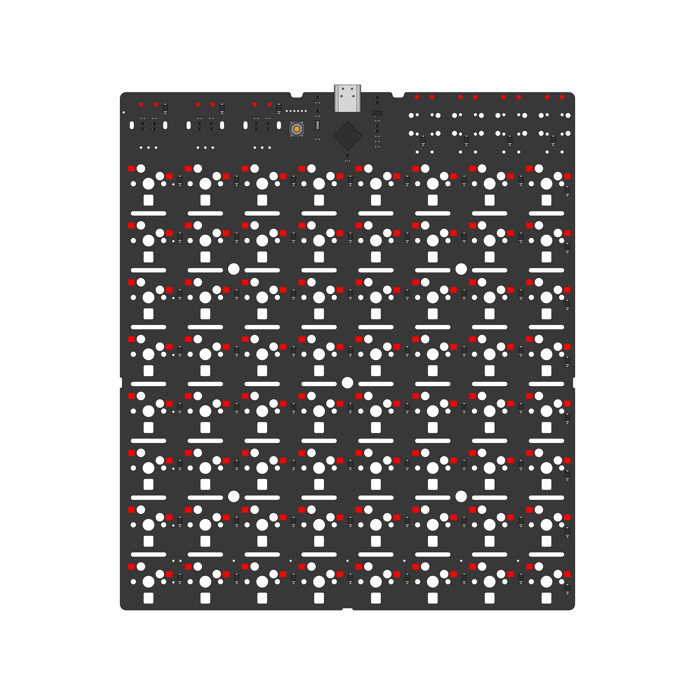
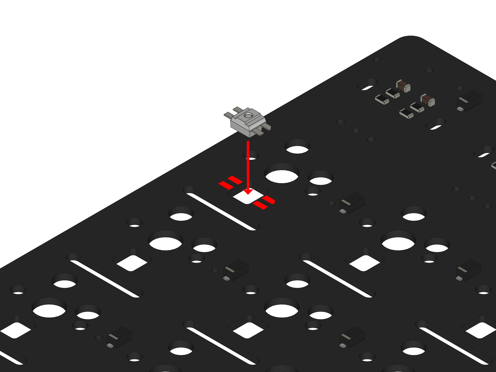
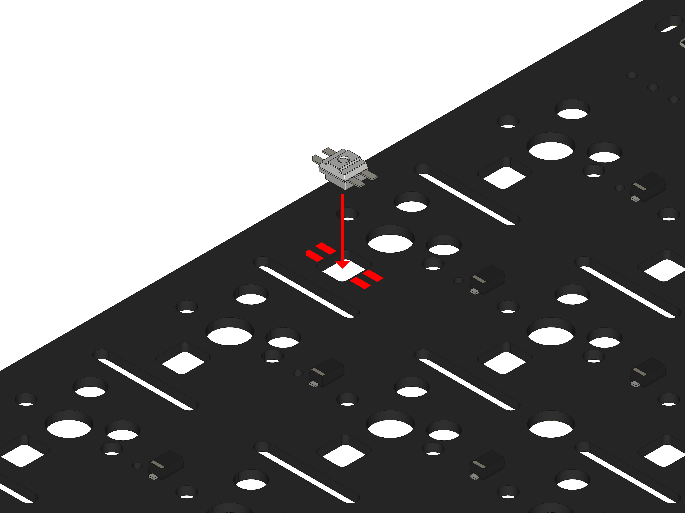
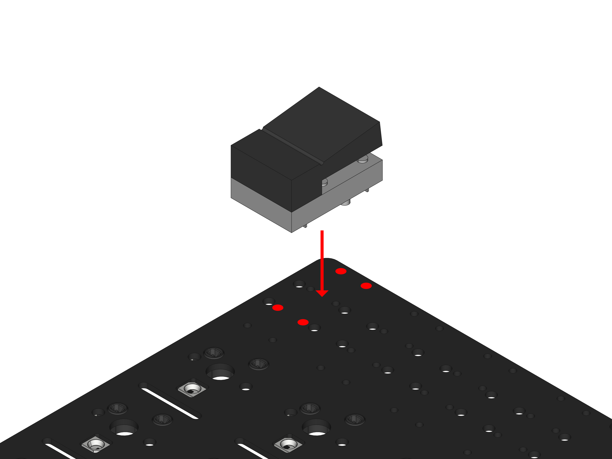
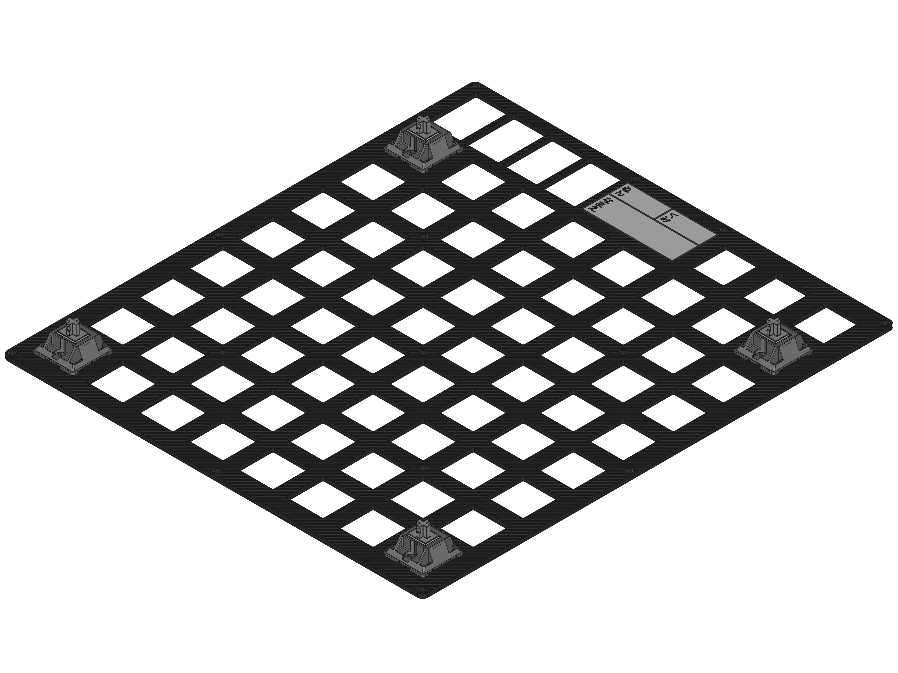
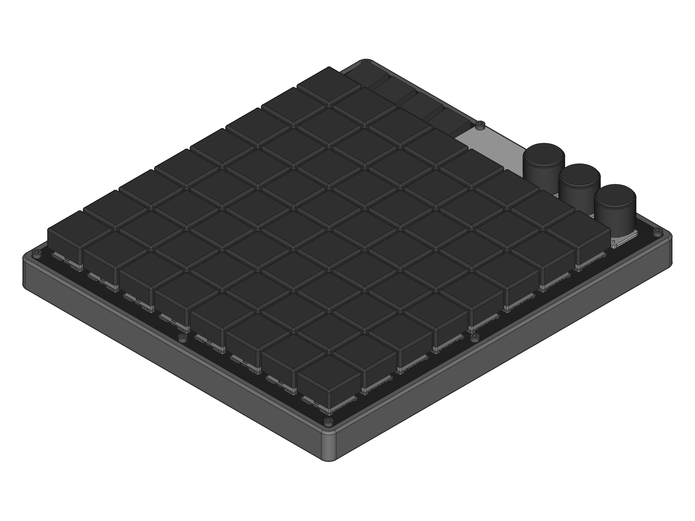

# Feuille64 ビルドガイド

## 目次
- [0. 事前準備](#0-事前準備)
  - [0.1. キットの内容物](#01-キットの内容物)
  - [0.2. キット以外に必要な部品](#02-キット以外に必要な部品)
  - [0.3. 必要工具](#03-必要工具)
  - [0.4. アイコンの説明](#04-アイコンの説明)
- [1. 動作確認](#1-動作確認)
- [2. 部品の実装](#2-部品の実装--)
  - [2.1. LEDの実装](#21-LEDの実装--)
  - [2.2. Kailhソケットの実装](#22-Kailhソケットの実装--)
  - [2.3. 休憩](#23-休憩)
  - [2.4. タクタイルスイッチの実装](#24-タクタイルスイッチの実装--)
  - [2.5. ロータリーエンコーダの実装](#25-ロータリーエンコーダの実装--)
- [3. 組み立て](#3-組み立て--)
  - [3.1. キースイッチの取り付け](#31-キースイッチの取り付け)
  - [3.2. ボトムプレートの組み立て](#32-ボトムプレートの組み立て--)
  - [3.3. 3Dプリントケースの取り付け](#33-3Dプリントケースの取り付け)
  - [3.4. ボトムプレートの取り付け](#34-ボトムプレートの取り付け--)
  - [3.5. アクセントプレートの取り付け](#35-アクセントプレートの取り付け--)
  - [3.6. ゴム足の取り付け](#36-ゴム足の取り付け)
  - [3.7. キーキャップとノブの取り付け](#37-キーキャップとノブの取り付け)
  - [3.8. 完成](#38-完成)

---

## 0. 事前準備
### 0.1. キットの内容物

|||
|---|---|

|| 名前 | 数量 | 備考 |
|:---:|---|---:|---|
|1|メインPCB|1||
|2|トッププレートPCB|1||
|3|ボトムプレートPCB A|1||
|4|ボトムプレートPCB B|1||
|5|ボトムプレートPCB C|1||
|6|ボトムプレートPCB D|1||
|7|アクセントプレート(ミラー)|1||
|8|アクセントプレート(ブラック)|1||
|9|Kailhソケット|64|CPG151101S11|
|10|スペーサ|9|M2 8mm(ARL-2008BE)|
|11|スペーサ|2|M2 2mm(CL-2002BE)|
|12|スペーサ|1|M2 1mm(CL-2001BE)|
|13|ネジ|9|M2 5mm(FC-0205)|
|14|ネジ|9|M2 6mm(FC-0206)|
|15|ネジ|2|M2 12mm(FC-0212)|
|16|ゴム足 大|4|TM-166-18|
|17|ゴム足 小|2|TM-166-8|

- ※ 販売形式によっては内容が異なる場合があります。

---

### 0.2. キット以外に必要な部品

|| 名前 | 数量 | 備考 |
|:---:|---|---:|---|
|1|キースイッチ|64|Cherry MX互換スイッチ|
|2|キーキャップ(1U)|64||
|3|タクタイルスイッチ|4|OMRON B3J無灯|
|4|ロータリーエンコーダ|3|Alps EC12シリーズ互換 ※1|
|5|ロータリーエンコーダ用ノブ|3||
|6|フルカラーシリアルLED|64|SK6812MINI-E|
|7|3Dプリントケース Aspecio Shell|1|※2|
|8|USB Type-Cケーブル|1||

- ※1 プッシュスイッチ内蔵のものが必要です。
- ※2 3Dプリントケース Aspecio Shellは以下より購入可能です。
  - [Feuille64 Aspecio Shell - DMM.make クリエイターズマーケット](https://make.dmm.com/item/1338868/)

---

### 0.3. 必要工具

- 温調ハンダごて
  - HAKKO [FX600](https://www.hakko.com/japan/products/hakko_fx600.html)がオススメです。
- ハンダ
- ピンセット
- 六角レンチ
  - 対角 1.5mm
- SIMピン
  - リセットスイッチ押下用

---

### 0.4. アイコンの説明

|アイコン|説明|
|:---:|---|
||ハンダ付けを必要とします。|
||ネジ留めを必要とします。|

---

## 1. 動作確認
　まず始めにメインPCBの動作確認を行います。
お使いのPCにメインPCBをUSB Type-Cケーブルで接続して正常に認識されることを確認してください。
認識されない場合はメインPCBの不良、もしくはUSB Type-Cケーブルがデータ通信用ではない可能性があります。
正常に認識されたらメインPCB裏面のランドおよびパッドをピンセットなどの導通するものを用いて順に短絡させてください。
初期状態のテストファームウェアでは、短絡させると任意の数字が入力されます。
テキストエディタなどを開いて数字が入力されることを確認してください。
これらが確認できたらメインPCBの動作確認は完了です。

　メインPCBの動作確認ができたらトッププレートPCBに学年と組、そして名前を記入しましょう。

---

## 2. 部品の実装  

　各部品をハンダ付けして実装します。
ビルドガイドの順に実装することをおすすめします。

---

### 2.1. LEDの実装  
　メインPCB裏面の64ヶ所にフルカラーシリアルLED実装します。
LEDの足の形状がパッドの形状と合うよう向きに注意してください。
奇数行と偶数行ではLEDの向きは180度回転します。

|||
|:---:|:---:|
|奇数行|偶数行|

LED実装が完了したらPCにメインPCBをUSB Type-Cケーブルで接続して正常に発光するか確認することをおすすめします。
初期状態のテストファームウェアでは、すべてのLEDが赤・緑・青の順に発光します。
LEDは画像の通り順に並んでいます。
一部のLEDで発光不良が発生した場合にはそのLEDおよび一つ前のLEDの実装を確認してください。

---

### 2.2. Kailhソケットの実装  
　メインPCB裏面の64ヶ所にKailhソケットをハンダ付けして実装します。
KailhソケットはメインPCBに密着するようにしてください。
向きがあるから注意

---

### 2.3. 休憩
　ここで休憩をとってください。
ハンダ付けを要する実装がまだ少し残っています。
手を洗って綺麗にしてからお茶でも飲んで一息つきましょう。

---

### 2.4. タクタイルスイッチの実装  
　メインPCB表面からタクタイルスイッチを挿し込み裏面からハンダ付けして実装します。
2パターンの実装方法があります。
タクタイルスイッチはメインPCBに密着するようにしてください。

|||
|:---:|:---:|
|||
|パターンA|パターンB|

---

### 2.5. ロータリーエンコーダの実装  
　メインPCB表面からロータリーエンコーダを挿し込み裏面からハンダ付けして実装します。
ロータリーエンコーダはメインPCBに密着するようにしてください。

|||
|:---:|:---:|

---

## 3. 組み立て  

### 3.1. キースイッチの取り付け
　トッププレートPCBの四隅にキースイッチを取り付けます。

|||
|:---:|:---:|

そこへメインPCBを取り付けます。

|||
|:---:|:---:|

残りのキースイッチを取り付けていきます。
メインPCBのKailhソケットにキーすいっとの足が

|||
|:---:|:---:|

---

### 3.2. ボトムプレートの組み立て  
　ボトムプレートPCB4枚を組み立てます。
ボトムプレートPCB Aの上にボトムプレートPCB BとボトムプレートPCB Cを重ね合わせます。

|||
|:---:|:---:|

スペーサM2 1mmとM2 2mmを該当の箇所に配置します。
ボトムプレートPCB Dに付属の両面テープを貼り付け透明の剥離紙を剥がしておきます。
その上からボトムプレートPCB Dをスペーサがずれないように重ねます。
ボトムプレートPCB Dに貼り付けた両面テープがボトムプレートPCB Bに完全に貼りつかないように注意してください。

|||
|:---:|:---:|

ネジM2 6mmとスペーサM2 8mmで10ヶ所を挟み込むように固定します。
ネジM2 5mmでは長さがやや足りない部分があるため
ネジを締める際は一箇所を一気に締め込むのではなく各ネジを順に均等に締めてください。
歪みなく固定ができたらボトムプレートPCB Dの両面テープを貼り付けた位置を軽く押さえボトムプレートPCB DとボトムプレートPCB Bを固定します。

|||
|:---:|:---:|

---

### 3.3. 3Dプリントケースの取り付け
　ボトムプレートに3Dプリントケースを取り付けます。
ボトムプレートに固定されたスペーサ 8mmが少しグラつく程度にネジ10ヶ所をやや緩めます。
3Dプリントケース内のくぼみにスペーサ 8mmがぴったりはまるようにボトムプレートに対して垂直に3Dプリントケースをはめこんでいきます。
緩めたネジを再度締め直して3Dプリントケースの取り付けは完了です。

|||
|:---:|:---:|

---

### 3.4. ボトムプレートの取り付け  
　キースイッチを取り付けたメインPCBおよびトッププレートPCBにボトムプレートを取り付けます。
ネジM2 5mmで7ヶ所ネジ留めして固定します。
3DプリントケースとトッププレートPCBおよびボトムプレートの間に隙間ができる場合は、3Dプリントケースを横から挟み込むように軽く押さえながらネジを締めてください。

|||
|:---:|:---:|

---

### 3.5. アクセントプレートの取り付け  
　アクセントプレートを取り付けます。
ミラーのみを取り付ける場合はネジM2 5mmを、
ミラーおよびブラックを取り付ける場合はネジM2 12mmを使用します。
アクセントプレートはアクリル製です。
強く締めすぎるとアクセントプレートが破損する可能性があるためご注意ください。

|||
|:---:|:---:|
|||
|パターンA|パターンB|

---

### 3.6. ゴム足の取り付け
ボトムプレートの四隅の凹みにゴム足を貼り付けます。
3ヶ所にゴム足 大(TM-166-18)を、1ヶ所にゴム足 小(TM-166-8)を貼り付けます。

---

### 3.7. キーキャップとノブの取り付け
キースイッチにキーキャップ64個を、ロータリーエンコーダにノブ3個を取り付けます。
ノブの種類によっては側面のイモネジを締める必要があります。

### 3.8. 完成
　完成です。とてもかっこよく仕上がりましたね。
このまま棚に飾ってもいいでしょう。
そうです、あなたの部屋のその棚です。
しかしその前に必ず、かっこよく仕上がったFeuille64の写真を撮影してください。
動画を撮影しても構いません。
そしてSNSで自慢してください。
この手順を省略することはできません。
必ず行ってください。

　もし気の迷いでFeuille64をMIDIパッドとして利用されるのであれば、以降の手順でファームウェアの書き込みを行ってください。
