# Feuille64 ビルドガイド


## 目次
- [0. 事前準備](#0-事前準備)
  - [0.1. キットの内容物](#01-キットの内容物)
  - [0.2. キット以外に必要な部品](#02-キット以外に必要な部品)
  - [0.3. 必要工具](#03-必要工具)
  - [0.4. アイコンの説明](#04-アイコンの説明)
- [1. 動作確認](#1-動作確認)
- [2. 部品の実装](#2-部品の実装--)
  - [2.1. LEDの実装](#21-LEDの実装--)
  - [2.2. Kailhソケットの実装](#22-Kailhソケットの実装--)
  - [2.3. 休憩](#23-休憩)
  - [2.4. タクタイルスイッチの実装](#24-タクタイルスイッチの実装--)
  - [2.5. ロータリーエンコーダの実装](#25-ロータリーエンコーダの実装--)
- [3. 組み立て](#3-組み立て--)
  - [3.1. キースイッチの取り付け](#31-キースイッチの取り付け)
  - [3.2. ボトムプレートの組み立て](#32-ボトムプレートの組み立て--)
  - [3.3. 3Dプリントケースの取り付け](#33-3Dプリントケースの取り付け)
  - [3.4. ボトムプレートの取り付け](#34-ボトムプレートの取り付け--)
  - [3.5. アクセントプレートの取り付け](#35-アクセントプレートの取り付け--)
  - [3.6. ゴム足の取り付け](#36-ゴム足の取り付け)
  - [3.7. キーキャップとノブの取り付け](#37-キーキャップとノブの取り付け)
  - [3.8. 完成](#38-完成)
- [4. ファームウェア](#4-ファームウェア)
  - [4.a. QMK Toolbox](#4a-QMK-Toolbox)
    - [4.a.1. 事前準備](#4a1-事前準備)
      - [QMK Toolboxのダウンロード](#QMK-Toolboxのダウンロード)
      - [hexファイルのダウンロード](#hexファイルのダウンロード)
      - [リセットボタンの押し方](#リセットボタンの押し方)
    - [4.a.2. 起動と設定](#4a2-起動と設定)
    - [4.a.3. DFUで接続](#4a3-DFUで接続)
    - [4.a.4. 書き込み](#4a4-書き込み)
  - [4.b. QMKビルド環境を構築](#4b-QMKビルド環境を構築)
- [5. 完成](#5-完成)

---

## 0. 事前準備
### 0.1. キットの内容物

|||
|---|---|

||名前|数量|備考|
|:---:|:---|---:|:---|
|1|メインPCB|1||
|2|トッププレートPCB|1||
|3|ボトムプレートPCB A|1||
|4|ボトムプレートPCB B|1||
|5|ボトムプレートPCB C|1||
|6|ボトムプレートPCB D|1||
|7|アクセントプレート(ミラー)|1||
|8|アクセントプレート(ブラック)|1||
|9|Kailhソケット|64|CPG151101S11|
|10|スペーサ|9|M2 8mm(ARL-2008BE)|
|11|中空スペーサ 大|2|M2 2mm(CL-2002BE)|
|12|中空スペーサ 小|1|M2 1mm(CL-2001BE)|
|13|ネジ 小|9|M2 5mm(FC-0205)|
|14|ネジ 中|9|M2 6mm(FC-0206)|
|15|ネジ 大|2|M2 12mm(FC-0212)|
|16|ゴム足 大|4|TM-166-18|
|17|ゴム足 小|2|TM-166-8|

- ※ 販売形式によっては内容が異なる場合があります。

---

### 0.2. キット以外に必要な部品

||名前|数量|備考|
|:---:|:---|---:|:---|
|1|キースイッチ|64|Cherry MX互換スイッチ|
|2|キーキャップ(1U)|64||
|3|タクタイルスイッチ|4|OMRON B3J無灯|
|4|ロータリーエンコーダ|3|Alps EC12シリーズ互換 ※1|
|5|ロータリーエンコーダ用ノブ|3||
|6|フルカラーシリアルLED|64|SK6812MINI-E|
|7|3Dプリントケース Aspecio Shell|1|※2|
|8|USB Type-Cケーブル|1||

- ※1 プッシュスイッチ内蔵のものが必要です。
- ※2 3Dプリントケース Aspecio Shellは以下より購入可能です。
  - [Feuille64 Aspecio Shell - DMM.make クリエイターズマーケット](https://make.dmm.com/item/1338868/)

---

### 0.3. 必要工具

- 温調ハンダごて
  - HAKKO [FX600](https://www.hakko.com/japan/products/hakko_fx600.html)がオススメです。
- ハンダ
- ピンセット
- 六角レンチ
  - 対角 1.5mm
- SIMピン
  - リセットスイッチ押下用

---

### 0.4. アイコンの説明

|アイコン|説明|
|:---:|---|
||ハンダ付けを必要とします。|
||ネジ留めを必要とします。|

---

## 1. 動作確認
　まず始めにメインPCBの動作確認を行います。
お使いのPCにメインPCBをUSB Type-Cケーブルで接続して正常に認識されることを確認してください。
認識されない場合はメインPCBの不良、もしくはUSB Type-Cケーブルがデータ通信用ではない可能性があります。
正常に認識されたらメインPCB裏面のランドおよびパッドをピンセットなどの導通するものを用いて順に短絡させてください。
初期状態で書き込まれているテストファームウェアでは、短絡させると短絡箇所に対応した文字列が入力されます。
テキストエディタなどを開いて文字列が入力されることを確認してください。
これらが確認できたらメインPCBの動作確認は完了です。


　メインPCBの動作確認ができたらトッププレートPCBに学年と組、そして名前を記入しましょう。

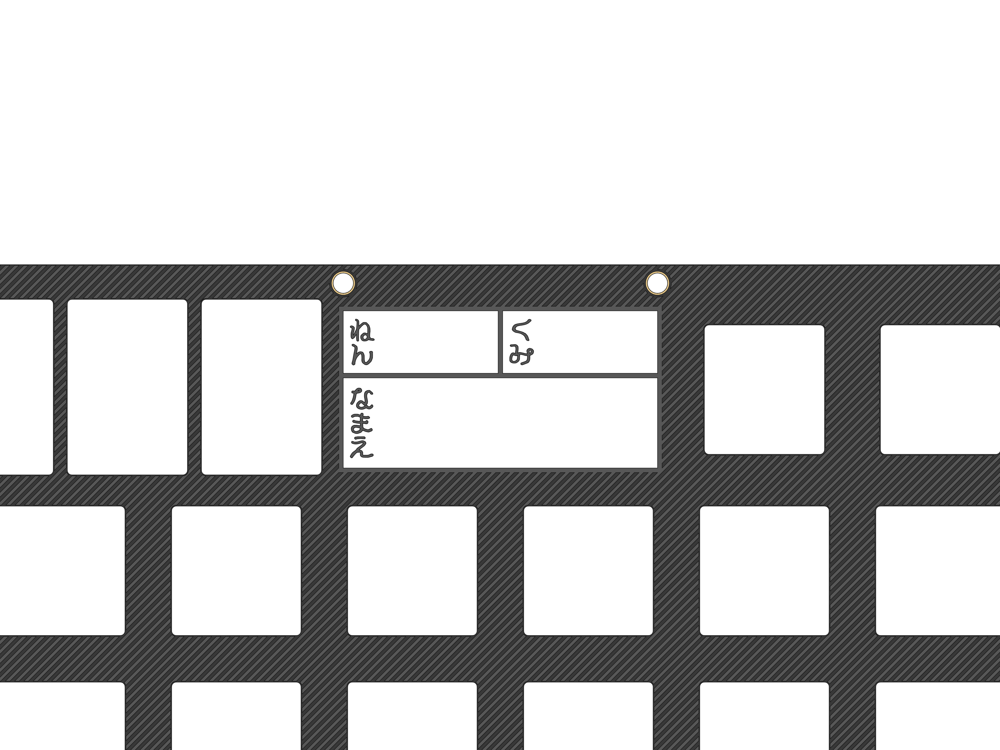

---

## 2. 部品の実装  

　各部品をハンダ付けして実装します。
本ビルドガイドの順に実装することをおすすめします。

---

### 2.1. LEDの実装  
　メインPCB裏面の64ヶ所にフルカラーシリアルLED実装します。
LEDの足の形状がパッドの形状と合うよう向きに注意して実装してください。
なお、奇数行と偶数行ではLEDの向きは180度回転します。

|||
|:---:|:---:|
|奇数行|偶数行|

　LEDの実装が完了したらメインPCBをPCにUSB Type-Cケーブルで接続して正常に発光するか確認することをおすすめします。
初期状態で書き込まれているテストファームウェアでは、すべてのLEDが赤・緑・青の順に発光を繰り返します。
すべてのLEDが同じ輝度で発光していることが確認できたらLEDの実装は完了です。

　もし一部のLEDで発光不良が発生した場合、そのLEDおよび一つ前のLEDの実装を確認してください。
LEDは以下の通りの順で数珠繋ぎ接続されています。

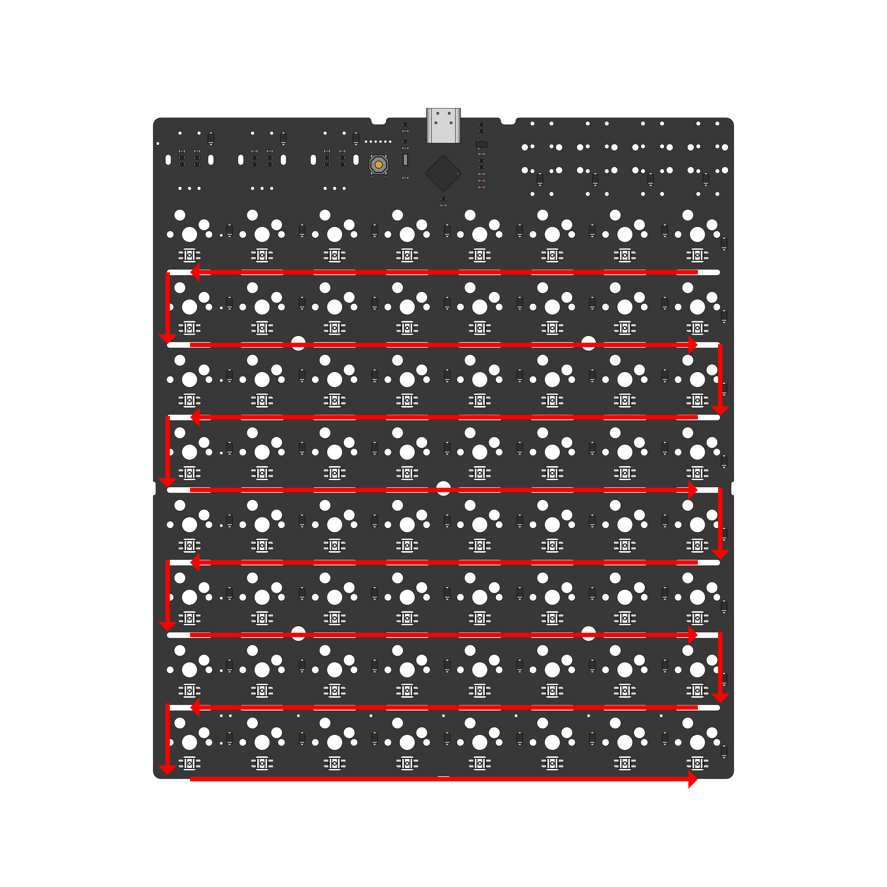

---

### 2.2. Kailhソケットの実装  
　メインPCB裏面の64ヶ所にKailhソケットをハンダ付けして実装します。
Kailhソケットは左右反転した状態でも実装できてしまいます。
向きに注意してかならず中央の一番大きな穴を覆い隠さない向きで実装してください。
また、KailhソケットはメインPCBにしっかり密着するようにしてください。
ハンダ量が少ないとキースイッチを固定する際にパッド剥離を起こす恐れがあるためご注意ください。

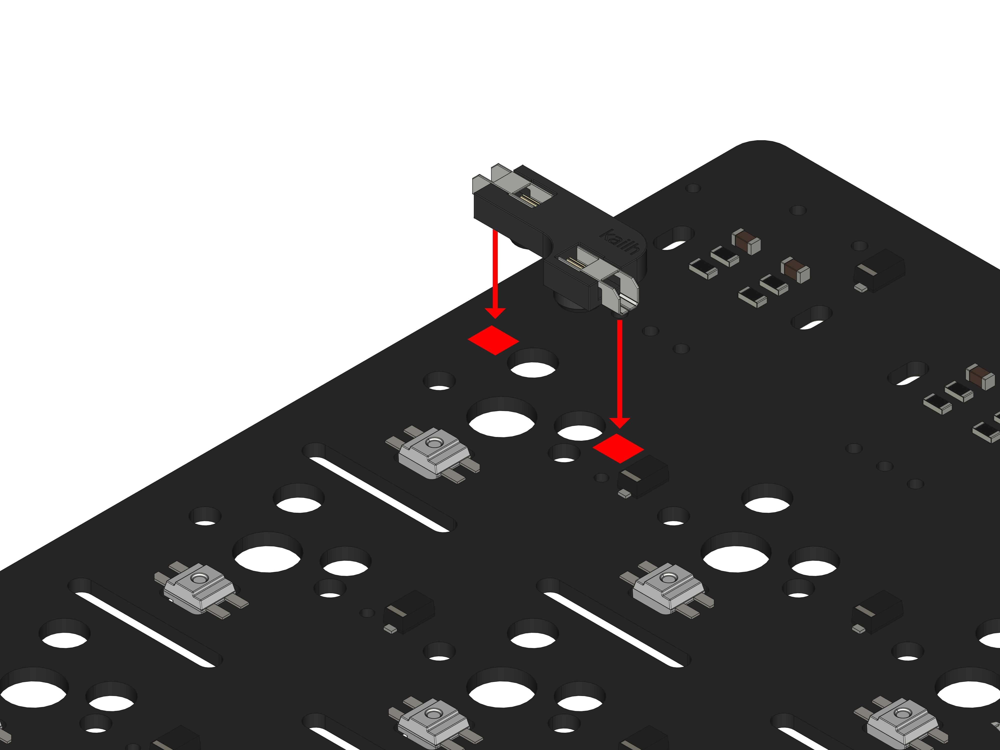

---

### 2.3. 休憩
　ここで休憩をとってください。
ハンダ付けを要する実装がまだ少し残っています。
手を洗って綺麗にしてからお茶でも飲んで一息つきましょう。

---

### 2.4. タクタイルスイッチの実装  
　メインPCB表面からタクタイルスイッチを挿し込み裏面からハンダ付けして実装します。
上下を反転した2パターンの実装方法があります。
タクタイルスイッチはメインPCBに密着するようにしてください。

|||
|:---:|:---:|
|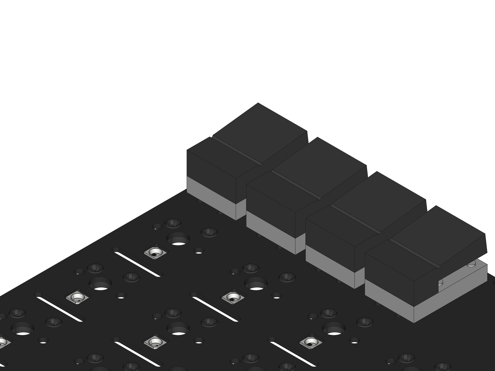|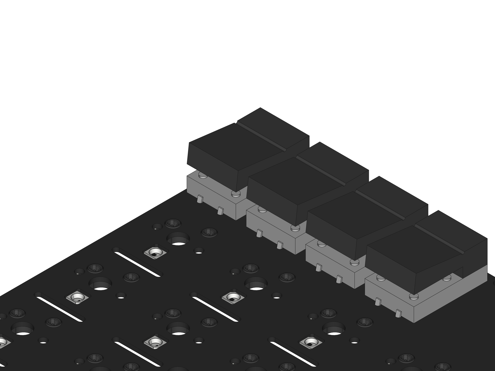|
|パターンA|パターンB|

---

### 2.5. ロータリーエンコーダの実装  
　メインPCB表面からロータリーエンコーダを挿し込み裏面からハンダ付けして実装します。
ロータリーエンコーダはメインPCBに密着するようにしてください。
ロータリーエンコーダの実装が完了したらメインPCBをPCにUSB Type-Cケーブルで接続して正常に動作するか確認することをおすすめします。
ロータリーエンコーダを左右に回すと対応した文字列が入力されます。
テキストエディタなどを開いて文字列が入力されることを確認してください。

|||
|:---:|:---:|

---

## 3. 組み立て  

### 3.1. キースイッチの取り付け
　トッププレートPCBの四隅にそれぞれ4個のキースイッチを取り付けます。
キースイッチの爪がトッププレートPCBに固定されていることを確認してください。

|||
|:---:|:---:|

　キースイッチを取り付けたトッププレートPCBにメインPCBを取り付けます。
1ヶ所ずつ順にキースイッチの足をKailhソケットに慎重に挿入してください。
各キースイッチがメインPCBから浮いていないことを確認してください。

|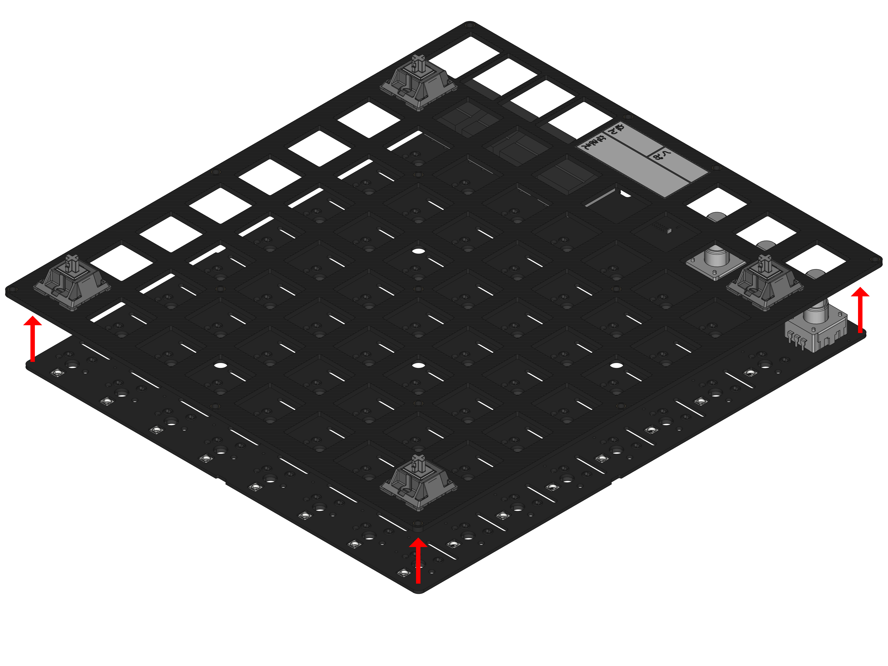||
|:---:|:---:|

残り60個のキースイッチを取り付けていきます。
最初に取り付けた4個のキースイッチ同様に、メインPCBのKailhソケットにキースイッチの足が正しく挿入されていることを確認してください。
すべてのキースイッチを取り付け終えたら、PCにUSB Type-Cケーブルで接続して正常に入力できるか確認してください。
万が一入力できないキーが発生した場合、キースイッチの足が折れ曲がっている、もしくはKailhソケットの実装に問題がある可能性があります。

||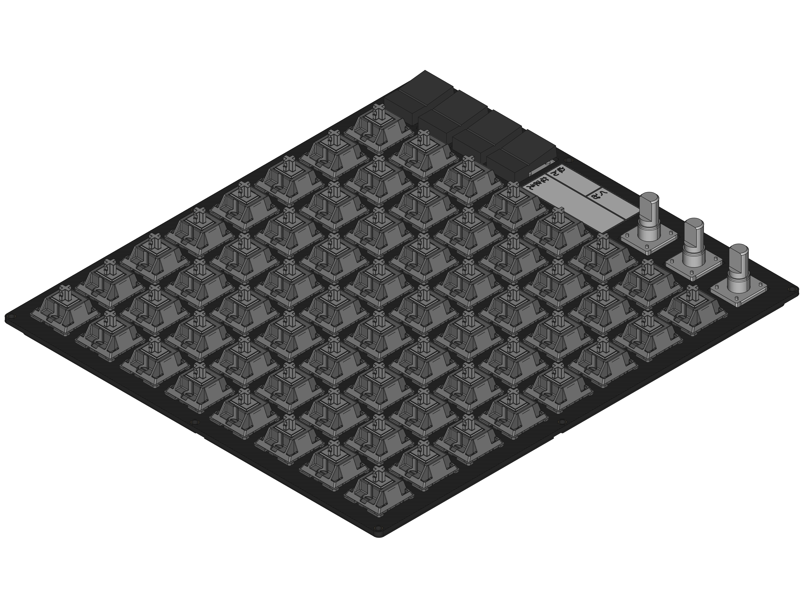|
|:---:|:---:|

---

### 3.2. ボトムプレートの組み立て  
　ボトムプレートPCB4枚を組み立てます。
ボトムプレートPCB Aの上にボトムプレートPCB BとボトムプレートPCB Cを重ね合わせます。
可能であればボトムプレートPCB Dの裏面に両面テープを貼り付けます。
組み立て後にボトムプレートPCB Dの浮き上がりを防ぐことができます。

||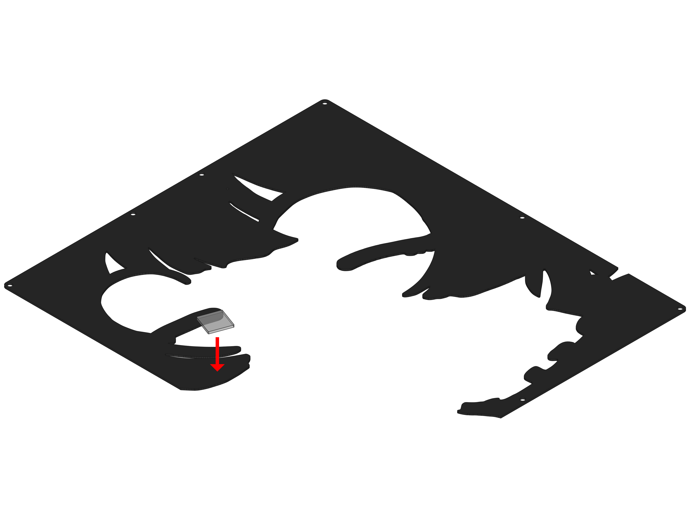|
|:---:|:---:|

　中空スペーサ 大2個と中空スペーサ 小1個を該当の箇所に配置します。
各中空スペーサはボトムプレートDを乗せたときに水平を保つ役割を果たします。
ボトムプレートPCB Dに両面テープを貼り付けた場合、剥離紙を剥がしておきます。
3枚のボトムプレートPCBを重ねた上にボトムプレートPCB Dを各中空スペーサがずれないように重ねます。
ボトムプレートPCB Dに貼り付けた両面テープがボトムプレートPCB Bに完全に貼りつかないようにご注意ください。

||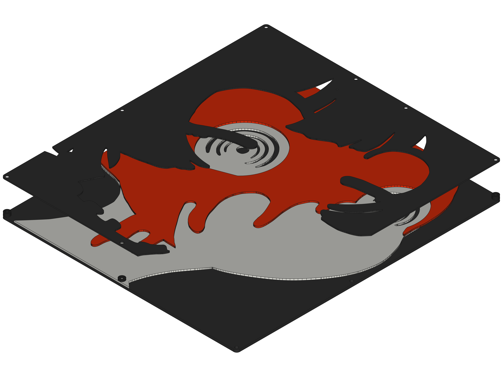|
|:---:|:---:|

　ネジ 中とスペーサで9ヶ所を挟み込むように固定します。
ネジ 小では長さがやや足りない部分があるため、かならずネジM2 中を使用してください。
ネジを締める際は一箇所を一気に締め込むのではなく各ネジを順に均等に締めてください。
このあとの3Dプリントケースの取り付けのため完全にネジを締めて固定する必要はありません。
各PCBがずれていないことが確認できたら、ボトムプレートPCB Dの両面テープを貼り付けた位置を軽く押さえ、ボトムプレートPCB DとボトムプレートPCB Bを固定します。

|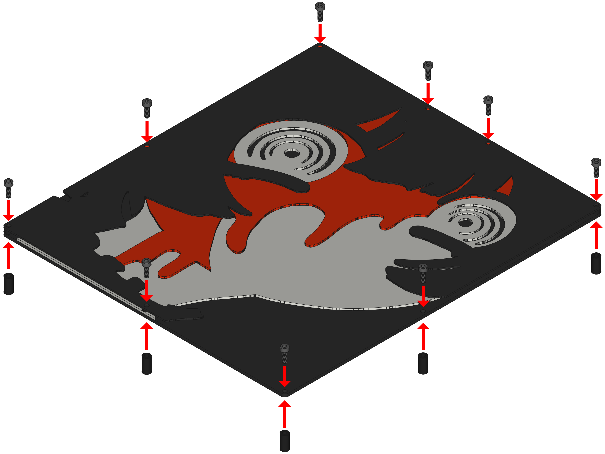||
|:---:|:---:|

---

### 3.3. 3Dプリントケースの取り付け
　ボトムプレートに3Dプリントケースを取り付けます。
3Dプリントケースには表裏の向きがあるのでご注意ください。
ボトムプレートに固定されたスペーサ 8mmが少しだけグラつく程度にネジ9ヶ所を緩めます。
3Dプリントケース内のくぼみにスペーサ 8mmがぴったりはまるようにボトムプレートに対して垂直に3Dプリントケースをはめこんでいきます。
3Dプリントケースがひっかかる場合は、一箇所ずつネジを緩めつつスペーサが3Dプリントケースに収まるように調整します。
ボトムプレートに3Dプリントケースがぴったりとはめこみ終えたら、緩めたネジを再度締め直して3Dプリントケースの取り付けは完了です。

|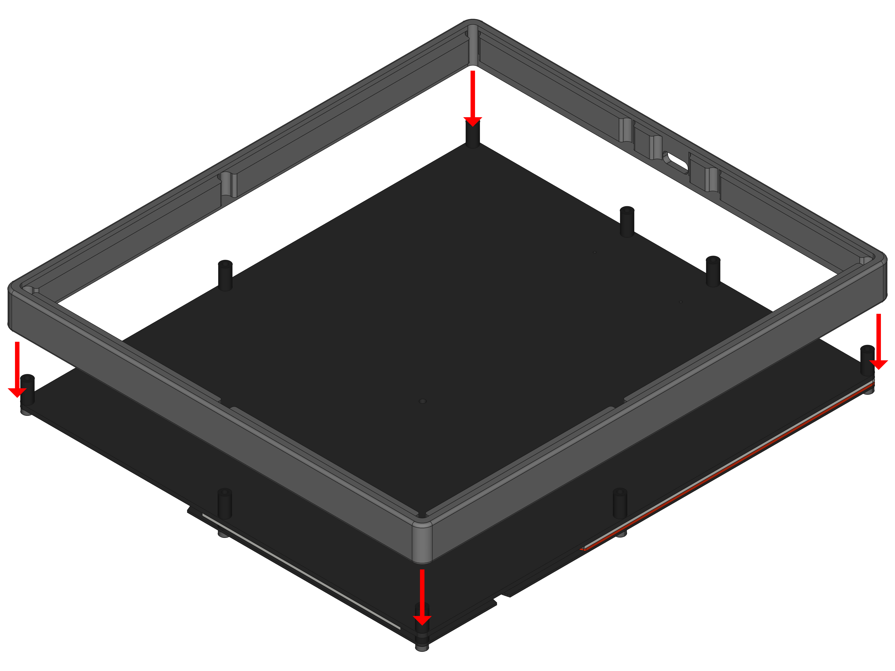||
|:---:|:---:|

---

### 3.4. ボトムプレートの取り付け  
　キースイッチを取り付けたメインPCBおよびトッププレートPCBにボトムプレートを取り付けます。
ネジ 小で7ヶ所ネジ留めして固定します。
メインPCBのUSB Type-C端子が3Dプリントケース側面の穴の位置から見えることを確認してください。
3DプリントケースとトッププレートPCBおよびボトムプレートの間に隙間ができる場合は、3Dプリントケースを横から挟み込むように軽く押さえながらネジを締めてください。

|||
|:---:|:---:|

---

### 3.5. アクセントプレートの取り付け  
　アクセントプレートを取り付けます。
2パターンの取り付け方法があります。
パターンAのミラーのみを取り付ける場合はネジ 小を、
パターンBのミラーおよびブラックを取り付ける場合はネジ 大を使用します。
アクセントプレートはアクリル製です。
ネジを強く締めすぎるとアクセントプレートが破損する可能性があるためご注意ください。

|||
|:---:|:---:|
|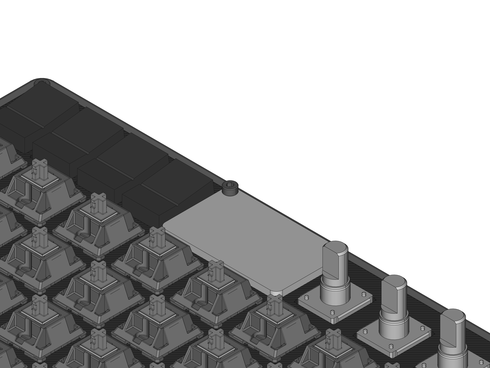|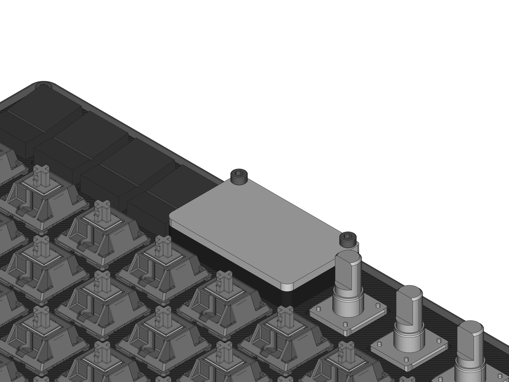|
|パターンA|パターンB|

---

### 3.6. ゴム足の取り付け
　ボトムプレートの四隅の凹みにゴム足を貼り付けます。
3ヶ所にゴム足 大(TM-166-18)を、1ヶ所にゴム足 小(TM-166-8)を貼り付けます。

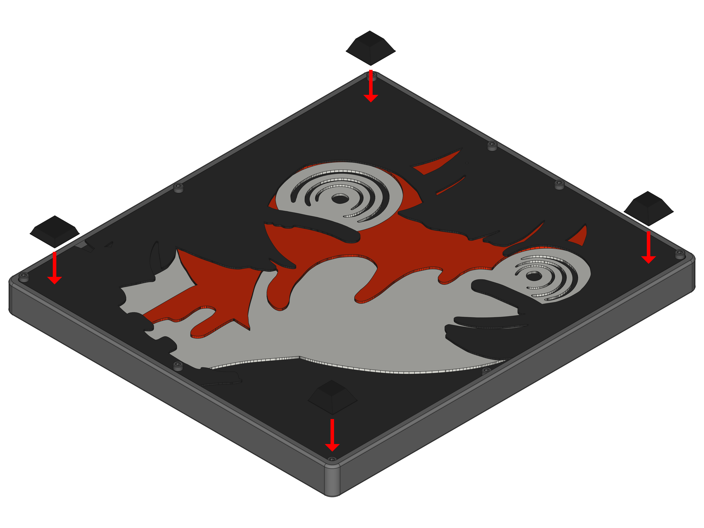

---

### 3.7. キーキャップとノブの取り付け
　キースイッチにキーキャップ64個、ロータリーエンコーダにノブ3個を取り付けます。
ノブの種類によっては側面のイモネジを締める必要があります。


---

### 3.8. 完成
　完成です。とてもかっこよく仕上がりましたね。
このまま棚に飾ってもいいでしょう。
そうです、あなたの部屋のその棚です。
しかしその前に必ず、かっこよく仕上がったFeuille64の写真を撮影してください。
動画を撮影しても構いません。
そしてSNSで自慢してください。
この手順を省略することはできません。
必ず行ってください。

　でもちょっと待ってください。
きっとお気付きだとは思いますが、実はそのFeuille64はそのままではMIDIパッドとして動作しません。
初期状態では動作確認用のテストファームウェアが書き込まれているからです。
以降の手順でファームウェアの書き込みを行ってください。

---

## 4. ファームウェア
　Feuille64はQuantum Mechanical Keyboard Firmware(以下、QMK)に対応しています。
ここでは2通りのファームウェアの書き込み方法を説明します。

### 4.a. QMK Toolbox
#### 4.a.1. 事前準備
##### QMK Toolboxのダウンロード

　以下のリンクよりQMK Toolboxをダウンロードし、初回起動を済ませドライバのインストールを行ってください。

- [QMK Toolbox ビルド済みバイナリ](https://github.com/qmk/qmk_toolbox/releases)
- [QMK Toolbox 公式リポジトリ](https://github.com/qmk/qmk_toolbox)

---

##### hexファイルのダウンロード

　以下にビルド済みのhexファイルがあります。
使用したいバージョンのhexファイルをダウンロードして準備してください。

- [hexファイル](../hex/)

---

##### リセットボタンの押し方

　ボトムプレートに小さな穴が空いています。
その穴へSIMピンなどを挿入してリセットボタンを押すことができます。
PCにUSB Type-Cケーブルで接続した状態でリセットボタンを押すと、Feuille64がDFU(Device Firmware Upgrade)で接続されます。

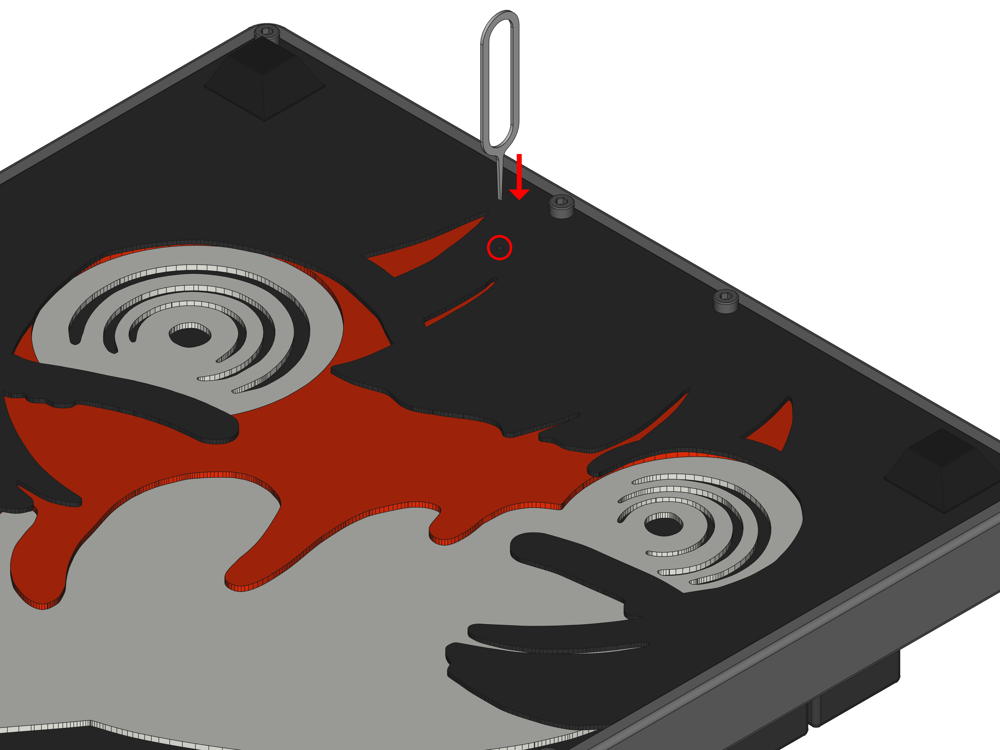

---

#### 4.a.2. 起動と設定
　QMK Toolboxを立ち上げ、Openボタンから用意したhexファイルを開きます。
そして`MCU(AVR Only)`を`atmega32u4`に変更します。
基本的な設定は以上です。

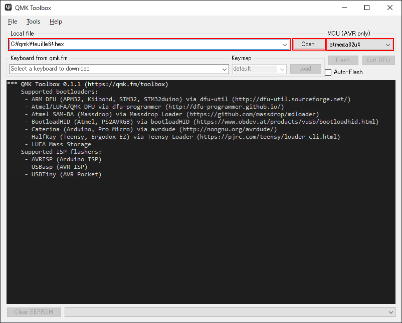

---

#### 4.a.3. DFUで接続
　Feuille64をPCにUSB Type-Cケーブルで接続してください。
その状態でリセットボタンを押すと、QMK Toolboxに以下の文面が表示されDFUで接続されます。
このとき同時にFlashボタンが有効になっています。
これでファームウェアを書き込む準備は完了しました。

```
*** Atmel DFU device connected (libusb0): Atmel Corporation ATmega32U4 (03EB:2FF4:0000)
```

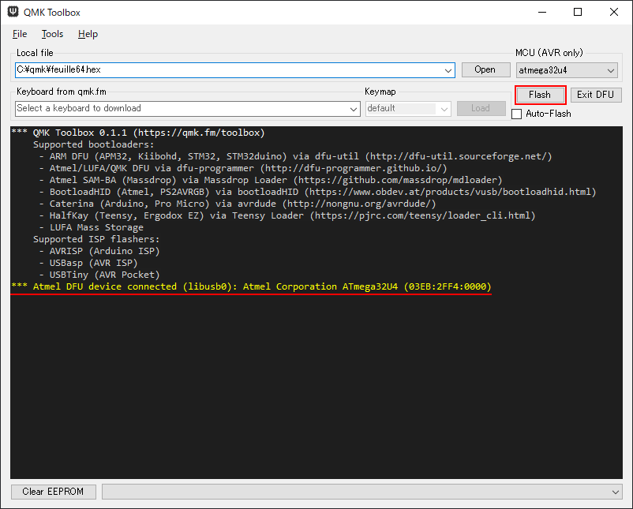

---

#### 4.a.4. 書き込み

　Flashボタンを押しファームウェアを書き込みます。
ファームウェアの書き込み中はFeuile64本体およびUSBケーブルには触れないようご注意ください。
ファームウェアの書き込みが完了したら自動的にDFUでの接続が解除されます。

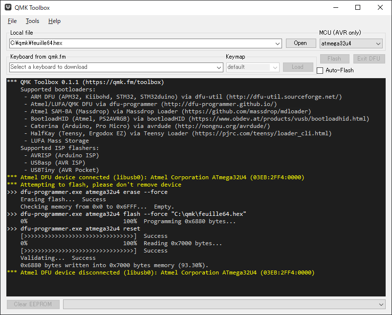

---

### 4.b. QMKビルド環境を構築

　QMKをソースコードからビルドしてファームウェアを書き込む方法です。
キーレイアウトなどのFeuille64の動作すべてを独自にカスタマイズして利用したい場合は、こちらを行ってください。
お使いのPCによって手順が大きく異なるため、詳しい説明は省略します。
以下のリンクを参考にご自身で進めてください。

- [QMK Firmware 日本語ドキュメント](https://docs.qmk.fm/#/ja/)
- [QMK GitHub 公式リポジトリ](https://github.com/qmk/qmk_firmware/)

---

## 5. 完成
　今度こそようやく完成です。
最高にかっこいいMIDIパッドができあがったのではないでしょうか。
ファームウェアを自由にカスタマイズできるあなただけのMIDIパッドです。
世界に1台だけのMIDIパッドでかっこよく演奏してみましょう。

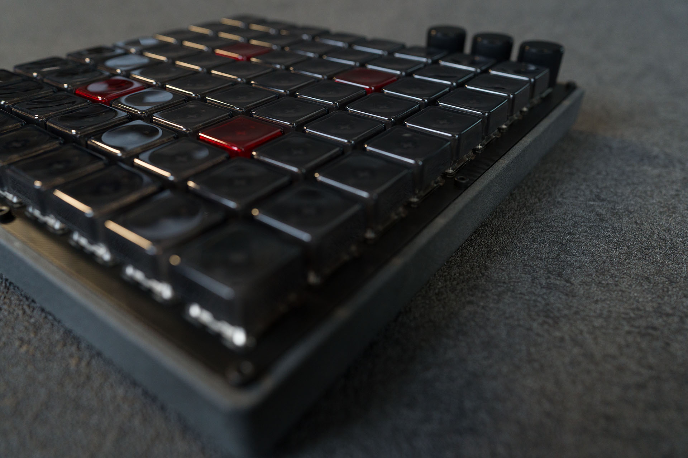
